## Part 1. Ready-made docker
+ Take the official docker image from nginx and download it using docker pull.

    `docker pull nginx`

    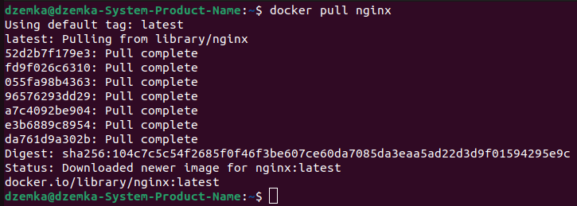

+ Check for the docker image with docker images

    `docker images`

    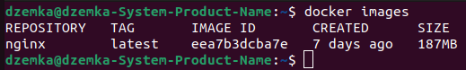

+ Run docker image with docker run -d [image_id|repository]

    `docker run -d nginx`

    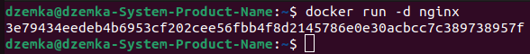

+ Check that the image is running with docker ps

    `docker ps`

    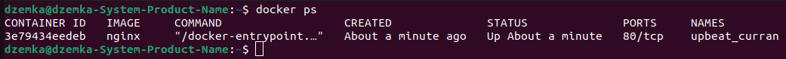

+ View container information with docker inspect [container_id|container_name]
+ From the command output define and write in the report the container size, list of mapped ports and container ip

    `docker inspect --size 3e | grep -E -A 1 "SizeRootFs|ExposedPorts|\"IPAddress\""`

    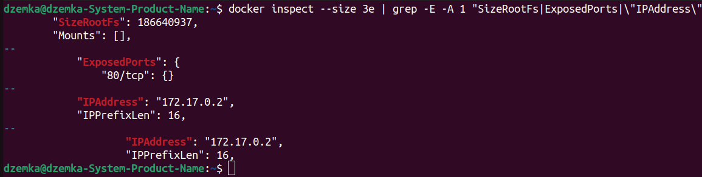

+ Stop docker image with docker stop [container_id|container_name]
    
    `dokcer stop 3e`

    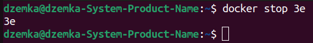

+ Check that the image has stopped with docker ps

    `docker ps`

    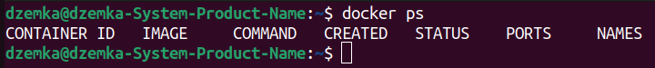

+ Run docker with ports 80 and 443 in container, mapped to the same ports on the local machine, with run command

    `docker run -d -p 80:80 -p 443:443 nginx`

    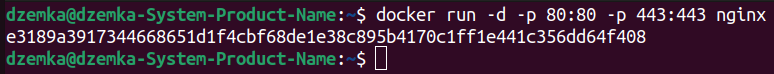

+ Check that the nginx start page is available in the browser at localhost:80

    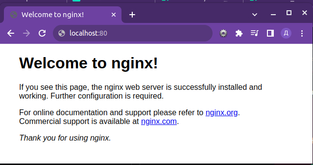

+ Restart docker container with docker restart [container_id|container_name]
    
    `docker restart e3`

    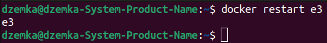

+ Check in any way that the container is running

    `docker ps`

    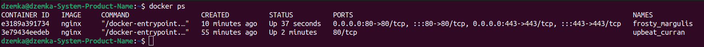


## Part 2. Operations with container

+ Read the nginx.conf configuration file inside the docker container with the exec command

    `docker exec e3 cat /etc/nginx/nginx.conf`

    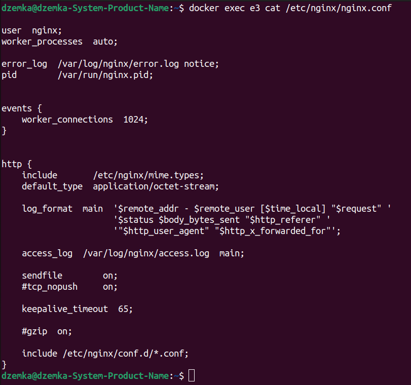

+ Create a nginx.conf file on a local machine

    `cat nginx.conf`

    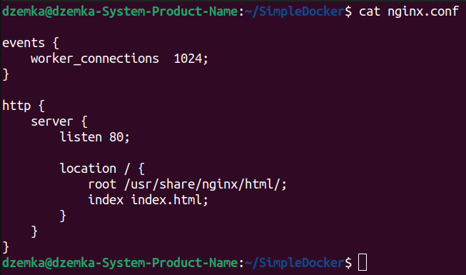

+ Configure it on the /status path to return the nginx server status page

    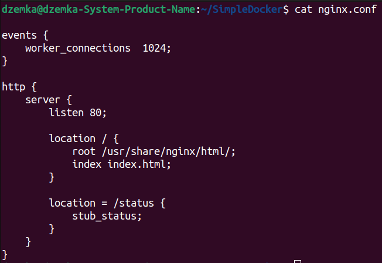

+ Copy the created nginx.conf file inside the docker image using the docker cp command

    `docker cp nginx.conf e3:/etc/nginx/`

    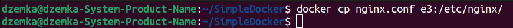

+ Restart nginx inside the docker image with exec

    `docker exec e3 nginx -s reload`

    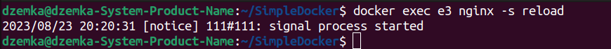

+ Check that localhost:80/status returns the nginx server status page

    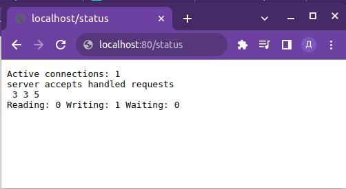

+ Export the container to a container.tar file with the export command

    `docker export e3 -o container.tar`

    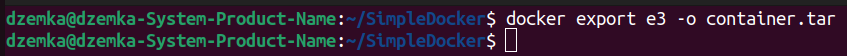

+ Stop the container

    `docker stop e3`

    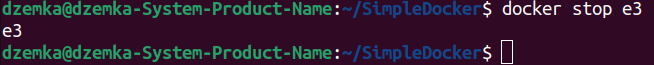

+ Delete the image with docker rmi [image_id|repository]without removing the container first

    `docker rmi -f eea`

    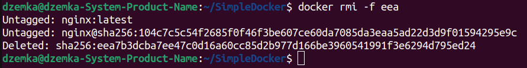

+ Delete stopped container

    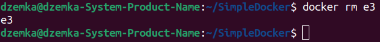

+ Import the container back using the importcommand

    `docker import -c 'ENTRYPOINT ["/docker-entrypoint.sh"]' -c 'CMD ["nginx", "-g", "daemon off;"]' container.tar`

    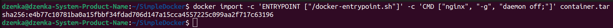

+ Run the imported container
    `docker run e4`

    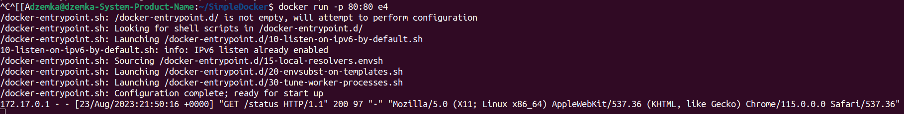

+ Check that localhost:80/status returns the nginx server status page

    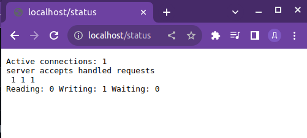

+ Put the nginx.conf file under ./nginx/nginx.conf (you will need this later)

    `docker cp 43:/etc/nginx/nginx.conf ./nginx/nginx.conf`

## Part 3. Mini web server

+ Write a mini server in C and FastCgi that will return a simple page saying Hello World!

    ```c
    #include "fcgi_stdio.h"
    #include <stdlib.h>

    int main(void)
    {
        while(FCGI_Accept() >= 0)
        {
            printf("Content-type: text/html\r\n\r\nHello World!");
        }
        return 0;
    }
    ```

    [server code](server/server.c)

+ Run the written mini server via spawn-fcgi on port 8080

    + Install gcc, libfcgi-dev and spawn-fcgi

        `apt update`

        `apt install gcc`
    
        `apt install libfcgi-dev`
    
        `apt install spawn-fcgi`

    + Compile server

        `gcc main.c -lfcgi -o server`

    + Run server

        `spawn-fcgi -p 8080 server`


+ Write your own nginx.conf that will proxy all requests from port 81 to 127.0.0.1:8080

    [nginx.conf](server/nginx.conf)

+ Check that browser on localhost:81 returns the page you wrote

    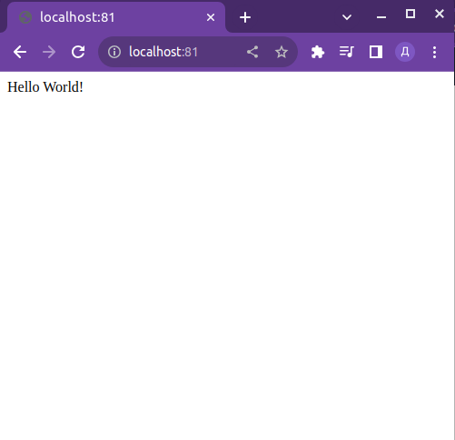

+ Put the nginx.conf file under ./nginx/nginx.conf (you will need this later)

    `docker cp 43:/etc/nginx/nginx.conf ./nginx/nginx.conf`


## Part 4. Your own docker

+ Write your own docker image that:

    1. builds mini server sources on FastCgi from Part 3


    2. runs it on port 8080

    3. copies inside the image written ./nginx/nginx.conf


    4. runs nginx.

    [Dockerfile](Dockerfile)

+ Build the written docker image with docker build, specifying the name and tag

    `docker build -t my_nginx:v01 .`

+ Check with docker images that everything is built correctly

    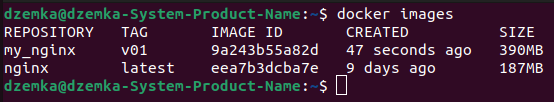

+ Run the built docker image by mapping port 81 to 80 on the local machine and mapping the ./nginx folder inside the container to the address where the nginx configuration files are located (see Part 2)

    `docker run -d -p 80:81 -v nginx:/etc/nginx/ my_nginx:v01`

+ Check that the page of the written mini server is available on localhost:80

    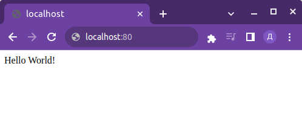

+ Add proxying of /status page in ./nginx/nginx.conf to return the nginx server status

    `location /status { stub_status }`

+ Restart docker image

    `docker restart 80`

+ Check that localhost:80/status now returns a page with nginx status

    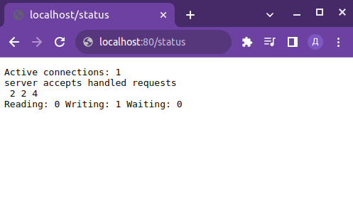

## Part 5. Dockle

+ Check the image from the previous task with dockle [image_id|repository]

    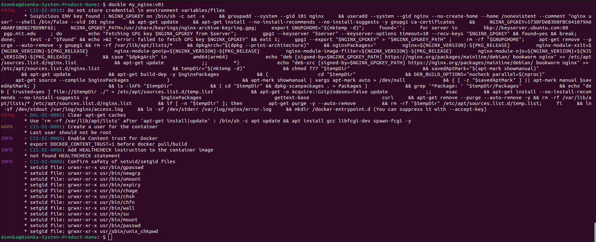

+ Fix the image so that there are no errors or warnings when checking with dockle

    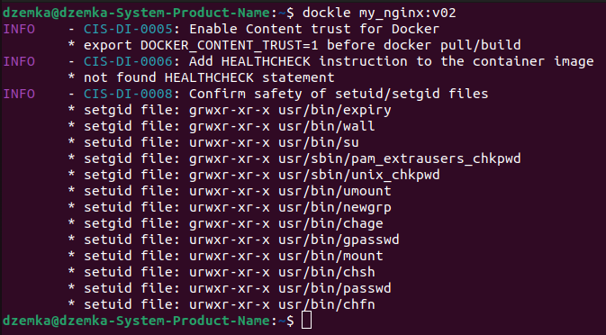

[Dockerfile](part_5/Dockerfile)

## Part 6. Basic Docker Compose

+ Write a docker-compose.yml file, using which:

    1. Start the docker container from Part 5 (it must work on local network, i.e., you don't need to use EXPOSE instruction and map ports to local machine)

    2. Start the docker container with nginx which will proxy all requests from port 8080 to port 81 of the first container

    Map port 8080 of the second container to port 80 of the local machine

+ Stop all running containers

    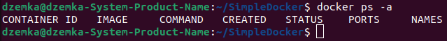

+ Build and run the project with the docker-compose build and docker-compose up commands

    `docker-compose build`

    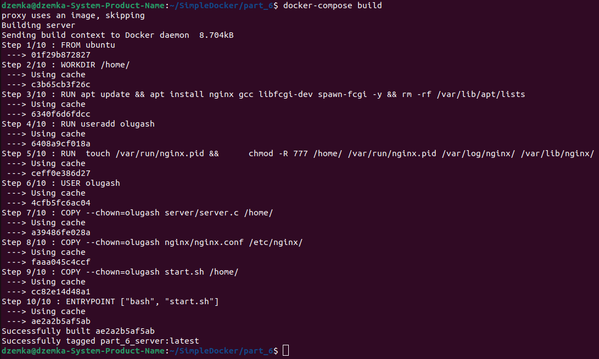

    `docker-compose up`

    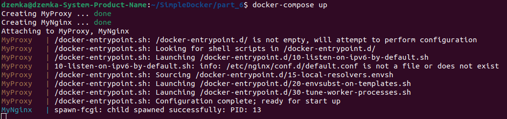

+ Check that the browser returns the page you wrote on localhost:80 as before

    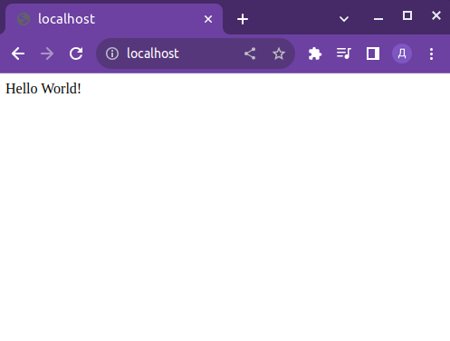